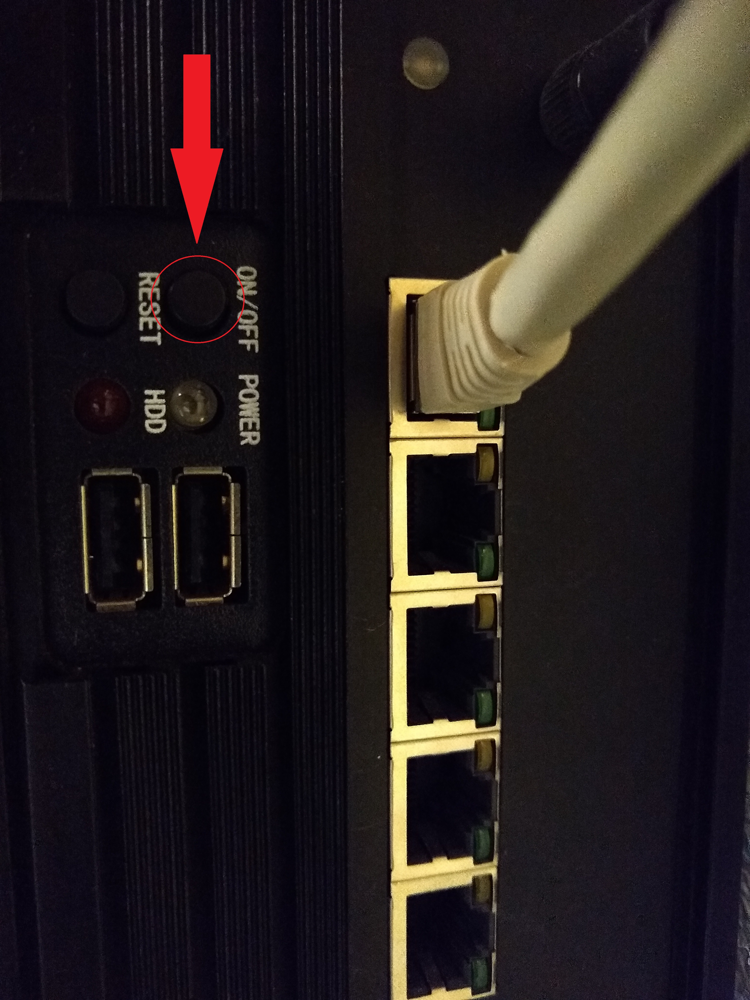

Welcome to the Guide for Phasespace Motion Capture System.

<!-- More -->

## Ubuntu System

The following instructions has been tested on Ubuntu 14.04 only.
- You can get the 64 bits system [here](http://releases.ubuntu.com/14.04/).
- To create a bootable USB, please refer to information [here](https://tutorials.ubuntu.com/tutorial/tutorial-create-a-usb-stick-on-windows#0).
- You are recommended to partition the harddrive with the `Disks` that comes with Ubuntu. Otherwise, you might see this during installation:
> The partition * assigned to / starts at an offset of * bytes from the minimum alignment for this disk, which may lead to very poor performance.

Ubuntu doesn't automatically use the nvidia driver. You can search for Additional Drivers to use them. You might need to setup the correct ppa

```bash
sudo add-apt-repository ppa:xorg-edgers/ppa -y
sudo apt-get update
```

## ROS

The version `indigo` is used for Kuka. Basically, you just need to follow [these instructions](http://wiki.ros.org/indigo/Installation/Ubuntu), or the following instructions copied below for your convenience.

```bash
sudo sh -c 'echo "deb http://packages.ros.org/ros/ubuntu $(lsb_release -sc) main" > /etc/apt/sources.list.d/ros-latest.list'
sudo apt-key adv --keyserver 'hkp://keyserver.ubuntu.com:80' --recv-key C1CF6E31E6BADE8868B172B4F42ED6FBAB17C654
```

```bash
sudo apt-get update && sudo apt-get install dpkg
sudo apt-get install ros-indigo-desktop-full
```

```bash
sudo rosdep init
rosdep update
```

```bash
echo "source /opt/ros/indigo/setup.bash" >> ~/.bashrc
source ~/.bashrc
```

```bash
sudo apt install python-rosinstall python-rosinstall-generator python-wstool build-essential
```

You are also recommended to get the catkin tools, the official installation guide is [here](https://catkin-tools.readthedocs.io/en/latest/installing.html):

```bash
sudo sh -c 'echo "deb http://packages.ros.org/ros/ubuntu `lsb_release -sc` main" > /etc/apt/sources.list.d/ros-latest.list'
wget http://packages.ros.org/ros.key -O - | sudo apt-key add -
```

```bash
sudo apt-get update
sudo apt-get install python-catkin-tools
```

## Turn on the Phasespace system

To turn it on, just need to locate the server computer. The picture below shows the location:


Press the on/off button to turn it on:



## Phasespace Software

There is no need to install drivers on your machine, as it was already isntalled on the phasespace server. 

On the kuka machine, just go to `recap` directory in the home direction, and then double-click the recap executable file to run it.

For more information, please visit `https://github.com/ScazLab/phasespace_publisher.git`

To install it on your machine, just copy the `recap` folder to your computer. 


## Phasespace ROS
To get a clean copy, rather than the one with Baxter, just clone the kuka branch to your ros directory and than make it:

```bash
git clone -b kuka https://github.com/ScazLab/phasespace_publisher.git
cd ..
catkin build
```

Then just following the github to learn how to use it.

## Collaboration

- **Please edit this file** to add things you think are going to be useful. You can edit it by modifying [this file](https://github.com/ScazLab/ScazLab.github.io/blob/master/_posts/2019-07-12-UR5e-setup-guide.md)
